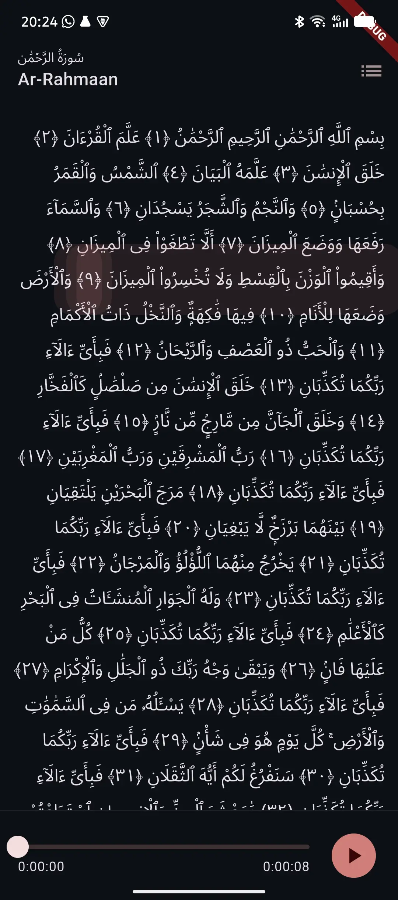
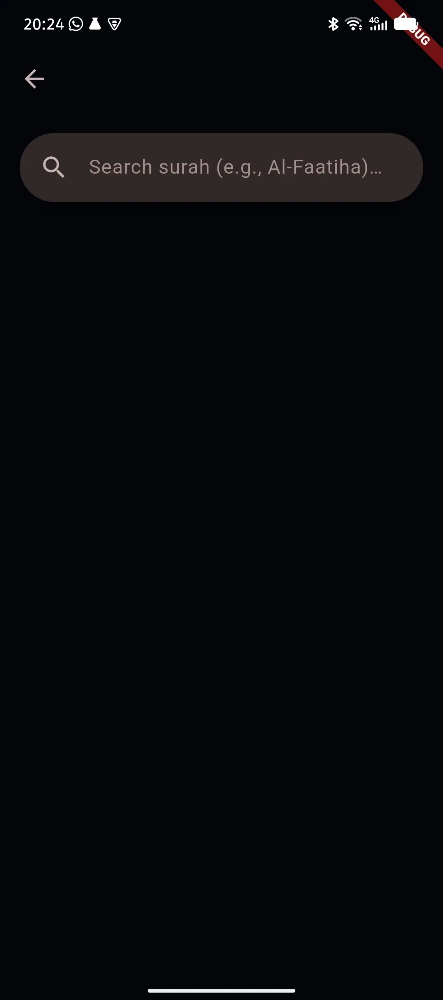
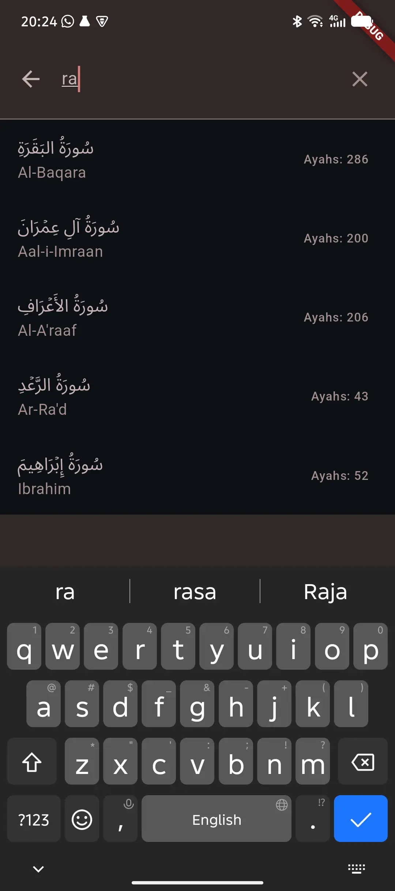

# quran

A Flutter project for Al Quran cloud - A full featured Quran app.

## Summary

Architecture overview:

The UI lives in `lib/src/pages`, while state management is handled in `lib/src/quran/states.dart` using [flutter_bloc](https://bloclibrary.dev/).

### Features

* Load a single surah.
* Load all surahs with search functionality.
* Play audio recitations.
* Android [adaptive icons.](https://developer.android.com/develop/ui/compose/system/icon_design_adaptive)

## Screenshots

<table width="100%">
  <tr>
    <td align="center" width="33%"></td>
    <td align="center" width="33%"></td>
    <td align="center" width="33%"></td>
  </tr>
</table>

## Video

<video src="videos/IMG_20260601_204541_720.mp4" width="320" controls></video>

## Getting started

This project is a Flutter application.

A few resources to get started:

- [Learn Flutter](https://docs.flutter.dev/get-started/learn-flutter)
- [Write your first Flutter app](https://docs.flutter.dev/get-started/codelab)
- [Flutter learning resources](https://docs.flutter.dev/reference/learning-resources)

For help getting started with Flutter development, view the
[online documentation](https://docs.flutter.dev/), which offers tutorials,
samples, guidance on mobile development, and a full API reference.
